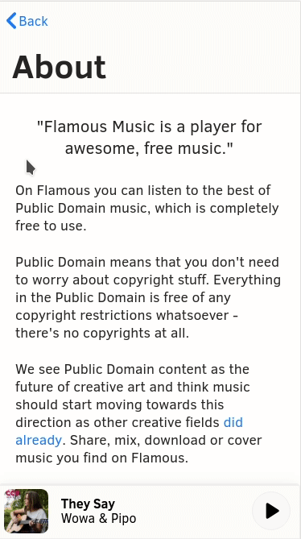
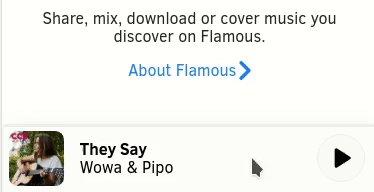
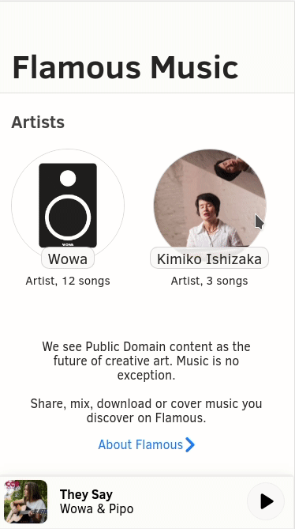
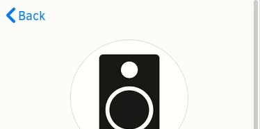

# Flamous Music

Listen to public domain music. No restrictions whatsoever. Share, mix, download and cover songs you find on Flamous Music.

The best of Public Domain music: [flamous.io](https://flamous.io/)

---

Flamous Music does several things to provide an app-like, seamless experience. We took lots of cues from the best designs around and try to integrate them into a clean, fun and modern experience.

Flamous Music is built with many great technologies, which we are very grateful for. But first, let's talk about what we are trying to achieve from a User Experience perspective.

## UX in Flamous Music

There are several things we incorporate that one might not expect from a typical web app. These little things are very important to us and we will showcase some of them here.

### Swipe interactions

Flamous Music implements several advanced swipe gestures where users normally would not expect such on a mobile website, but are common sense on native platforms. Our goal is to close the gap between the native and web platform and especially leverage all of the web's best features.

**Page swipe back:**

**TrackBar back/forward:**

**StreamView swipe down:**

### Navigation

**Routing && Stacking:**

**Sticky (dynamic) header:**

**Modern features**

Flamous Music is built as a Progressive Web App (PWA). As such, we implement offline functionality (only rudimentary as of yet), Media Session API, app icons and much more to be implemented.

---

The newest development version of Flamous Music is live at [next.flamous.io](http://next.flamous.io/). Use it to try new features and see our newest ideas. Please open issues here on GitHub if something is broken, you find bugs, or want some feature/have an idea for improvement.

**Local development**

Flamous Music uses Parcel as its build tool. To run the project locally clone the git repository with your terminal: `git clone [https://github.com/Flamous/flamous-music](https://github.com/Flamous/flamous-music)`. Then change directory cd flamous-music and install all project dependencies with npm install (requires Node.js being installed first). Finally, to see the site in action run npm start and open [http://localhost:1234/](http://localhost:1234/) in your browser. You can start playing with the code and see the changes in your browser right away!

---

Contact us: hello@flamous.io

©️ Christian Kaindl and Timon Röhrbacher

Licensed under MIT
